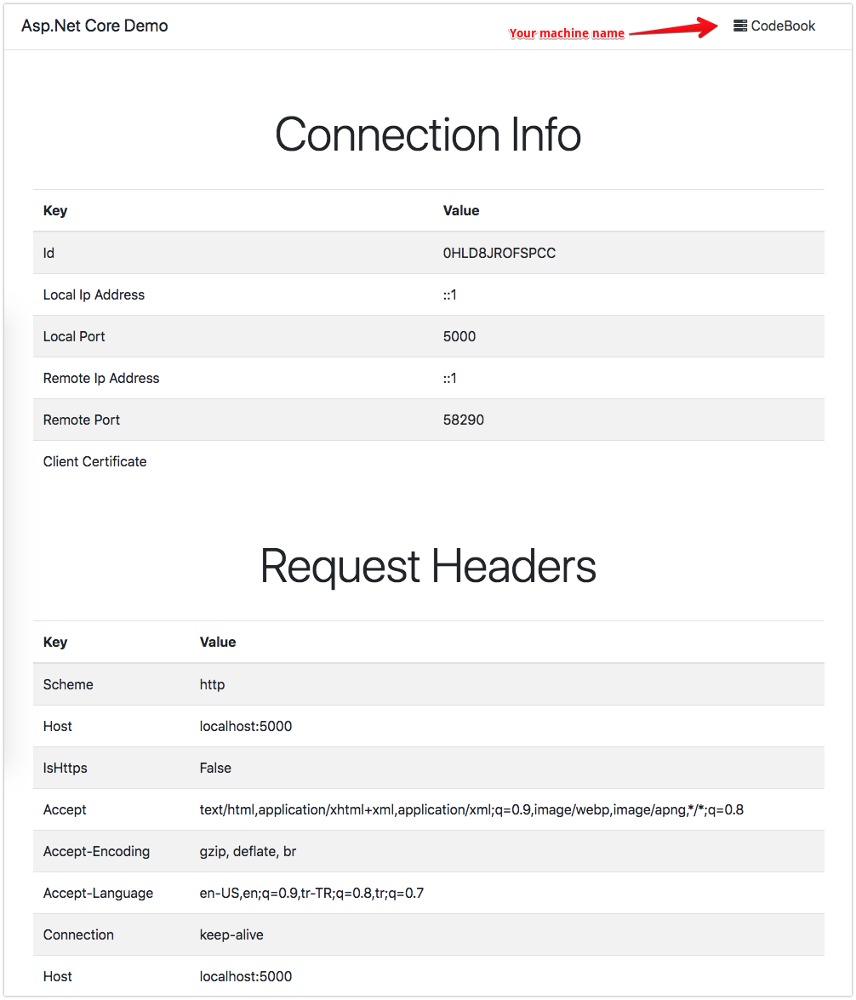

## What is this?

This is a simple Asp.net Core 2.0 Demo Application that can show your;

- Connection Info
- Request Headers
- Environment Variables

Also contains Dockerfile and Multistage Build.

### For what?

It is just for testing purposes.

### More?

Startup.cs is like;

```csharp
app.UseForwardedHeaders(new ForwardedHeadersOptions
{
    ForwardedHeaders = ForwardedHeaders.All,
    RequireHeaderSymmetry = false,
    ForwardLimit = null
});

if (env.IsDevelopment())
{
    app.UseDeveloperExceptionPage();
}
else
{
    app.UseExceptionHandler("/Home/Error");
}

app.UseHttpMethodOverride();
app.UseStaticFiles();
app.UseCookiePolicy();

app.UseMvc(routes =>
{
    routes.MapRoute(
        name: "default",
        template: "{controller=Home}/{action=Index}/{id?}");
});
```

It means forwards (for loadbalancer etc.) and method overrides will work without any configuration.

### How to build Docker image?

```sh
# It will build your Docker Image from your Dockerfile
# And will name it aspnetcore-demo
docker build -t aspnetcore-demo .
```

### How to run on Docker?

```sh
# It will run your Docker Image named by aspnetcore-demo
# Will give the port 4455 for testing on your http://localhost:4455 address
# And will name your container as aspnetcore-demo
docker run -p 4455:80 --name aspnetcore-demo aspnetcore-demo
```

### May I?

If you think we should add more something on this repository, feel free to PR 😊

### Thank you!

Thank you for using and contributing...